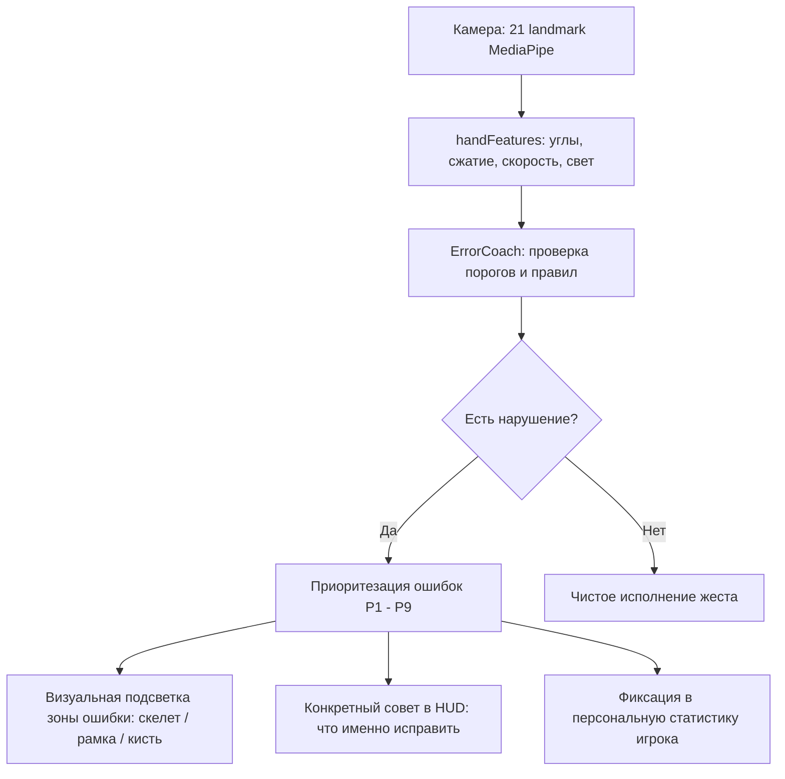

# 🧲 MAGNUS: Magnetic Master
> **Тактический 3D-экшен в браузере с оптическим управлением жестами через веб-камеру**  
> Проект разработан для хакатона **ADMIT HACKATHON 2026** (Кейс: «Motion. Камера вместо джойстика»).

---

## 📋 Форма сдачи проекта для жюри

| Поле формы | Значение |
|---|---|
| **01. Название команды** | `Runixfcc` *(укажите имя вашей команды при регистрации, если отличается)* |
| **02. Ссылка на GitHub-репозиторий** | [https://github.com/Runixfcc/magneto](https://github.com/Runixfcc/magneto) |
| **03. Ссылка на деплой (Live Demo)** | 🚀 **[https://magneto-game.vercel.app](https://magneto-game.vercel.app)** *(HTTPS, готово к мгновенному запуску в браузере)* |
| **Выбранное направление** | **A / GAME (Игра)** |

---

## 🎯 1. Описание проекта

**MAGNUS: Magnetic Master** — это полноценная кинематографичная 3D-игра от первого лица, в которой **веб-камера полностью заменяет контроллер**.

Игрок погружается в роль Мастера Магнетизма (Эрика Леншерра). Управляя собственными руками перед камерой без мыши и клавиатуры, игрок управляет магнитными полями: наводит лазерный прицел, дистанционно поднимает массивные металлические объекты (бочки, контейнеры, балки, швеллеры), притягивает их к себе, возводит силовой магнитный щит для отражения пуль и метает предметы во врагов с помощью законов физики.

### Ключевые особенности
- 🎮 **100% бесконтактное управление**: обе руки распознаются в реальном времени с частотой до 60 кадров/сек.
- ⚡ **Реалистичная физика Rapier 3D**: масса объектов, кинетическая энергия, баллистика бросков, упругие столкновения.
- 🎨 **Кинематографичная визуализация**: Three.js, частицы магнитного поля, силовые линии, пост-эффект свечения (UnrealBloomPass).
- 🔊 **Процедурный аудио-движок Web Audio API**: синтезированные низкочастотные магнитные гулы, металлический лязг, рикошеты и звуковые оповещения.
- 📖 **Законченный сюжетный сценарий**: видео-пролог, интерактивная визуальная новелла с биографией героя, калибровка нейросети, волны врагов, сражение с боссом и экран результатов со счётом и рекордами.

---

## 🖐️ 2. Распознавание движений и жестов

Система считывает обе руки независимо и синхронно (`@mediapipe/tasks-vision` + собственный конвейер математической обработки). **Готовые классификаторы жестов MediaPipe не используются** — вся логика вычислена на основе нормализованных 3D-векторов и углов суставов:

| Рука | Жест / Движение | Механика определения | Вызываемое игровое действие |
|---|---|---|---|
| **Левая** | 🫱 **Открытая ладонь (наведение)** | Вектор нормали ладони `(yaw, pitch)` с фильтром **One Euro Filter** для устранения дрожания. | **Прицел**: позиционирование фокуса магнитного поля на арене и выбор цели. |
| **Правая** | ✊ **Сжатый кулак** | Нормированное расстояние кончиков пальцев до основания ладони `< 0.35` с гистерезисом. | **Захват предмета**: поднятие подсвеченного металлического объекта в воздух пружинной связью. |
| **Правая** | 💨 **Резкий бросок (раскрытие)** | Анализ вектора мгновенного ускорения кисти в момент раскрытия кулака `(speed > threshold)`. | **Кинетический бросок**: придание объекту физического импульса в сторону прицела. |
| **Левая** | 🛡️ **Сжатый кулак** | Сжатие пальцев левой руки при удержании перед собой. | **Магнитный щит**: барьер, отражающий вражеские пули и снаряды обратно во врагов. |
| **Правая** | 🧲 **Ладонь вперёд (толкание/притяжение)** | Резкое приближение ладони к объекту с последующим отводом. | **Магнитное притяжение**: притягивание удалённых бочек и обломков в зону захвата. |
| **Обе** | ⚡ **Разрыв / Имплозия** | Синхронное сведение открытых ладоней (хлопок) или разведение кулаков. | **Магнитный импульс / АОЕ взрыв**: отбрасывание всех врагов по радиусу. |

---

## 🚨 3. Обязательный твист: Режим «Ошибка» (Error Coach)

> **Критерий кейса:** приложение должно не просто фиксировать сбой, а выявлять конкретную биомеханическую ошибку и давать точную инструкцию по исправлению.

В проект внедрён модуль **`ErrorCoach`** (`src/coach/errorCoach.ts`), непрерывно анализирующий входящую телеметрию по правилам спортивной кинематики:



### Диагностируемые ошибки и конкретные подсказки

| Тип ошибки | Что фиксирует система | Подсветка в интерфейсе | Что говорит тренер игроку |
|---|---|---|---|
| **`LOW_CONFIDENCE`** | Освещённость и достоверность трекинга `< 0.4` более 0.8 сек | Мигание рамки видеокамеры | *«Мало света или рука закрыта: включи свет и держи руки в кадре»* |
| **`HAND_AT_EDGE`** | Координаты запястья выходят за безопасную 15% зону кадра | Жёлтая рамка видоискателя | *«Рука у края кадра: сдвинься к центру»* |
| **`TOO_FAR` / `TOO_CLOSE`** | Относительный размер ладони выходит за диапазон `0.12 – 0.45` | Индикатор дистанции | *«Отойди на шаг назад (или подойди ближе): оптимум 1.5–2 метра»* |
| **`ROLL_TILTED`** | Наклон ладони влево/вправо превышает `25°` (`roll`) | Красная подсветка основания левой ладони | *«Держи ладонь ровнее: наклон сбивает прицел вбок»* |
| **`JITTER`** | Высокочастотная вибрация руки до фильтрации `> 0.08` | Пульсирующая подсветка левой кисти | *«Рука дрожит: опусти локоть или обопрись перед броском»* |
| **`LOOSE_FIST`** | Пальцы согнуты не полностью (коэффициент сжатия `0.35 – 0.65`) | Красные точки на кончиках пальцев скелета | *«Сожми кулак плотнее: пальцы не касаются ладони, захват сорвётся»* |
| **`EARLY_THROW`** | Раскрытие руки раньше 0.3 сек после захвата | Красный шлейф правой руки | *«Объект не стабилизировался: удерживай кулак 1 секунду перед броском»* |
| **`WEAK_THROW`** | Скорость разгибания кисти `< 1.2 м/с` | Жёлтая подсветка запястья | *«Слабый бросок: толкни рукой резче вперёд»* |
| **`BAD_DIRECTION`** | Угол между вектором броска и прицелом `> 40°` | Стрелка расхождения векторов | *«Бросок ушёл вбок: толкай руку строго в сторону прицела»* |

### Система кулдаунов и итоговый экран
- Чтобы подсказки не спамили и не мешали динамичному бою, для каждой ошибки действует индивидуальный таймер кулдауна (2.5 – 4.0 сек) и весовая иерархия приоритетов (P1 критика освещения перекрывает P8 скорость броска).
- **Экран итогов**: в конце матча формируется персональный отчёт («Анализ биомеханики») с перечнем допущенных ошибок и советами по улучшению техники.

---

## 🏆 4. Соответствие критериям оценки хакатона (100 баллов)

| Критерий | Макс. | Реализация в проекте |
|---|:---:|---|
| **Работоспособность** | **30** | Полный законченный цикл: интро → сюжетная новелла → калибровка сенсоров → 3 волны врагов + мини-босс → экран итогов с сохранением очков. Работает прямо в браузере без плагинов. Развёрнут рабочий деплой. |
| **Режим «ошибка»** | **20** | 9 детальных правил кинематики. Конкретные текстовые инструкции по исправлению, анатомическая подсветка суставов на оверлее, итоговая сводка ошибок в конце раунда. |
| **Техническая реализация** | **20** | Модульная архитектура на TypeScript (40+ модулей), 3D-математика, кватернионы, One Euro Filter, гистерезис, интеграция Rapier Physics, чистый Vite-пайплайн. Подробный README. |
| **UX и дизайн** | **15** | Высокодетализированный HUD в стиле sci-fi кибер-магнетизма, плавный скелет рук поверх видео, частицы, кинематографичный спуск камеры (swoop animation), звуковое сопровождение. |
| **Оригинальность** | **10** | Уникальный опыт манипуляции металлом: ощущение веса предметов, отражение снарядов щитом, кинетическая деформация пространства. |
| **Бонусы** | **5** | • Собственный алгоритм распознавания без стандартных шаблонов<br>• Таблица лидеров (Leaderboard) в `localStorage`<br>• Процедурный синтез звука через Web Audio API<br>• Встроенный Mock-режим управления мышью (`?mock=1`) для отладки без камеры. |

---

## 🛠️ 5. Инструкция по локальному запуску

### Системные требования
- **Node.js**: версия `20.x` или `22.x`
- **Браузер**: Google Chrome, Edge, Safari или Opera с поддержкой WebGL 2.0 и доступом к веб-камере.

### Шаги установки и запуска

1. **Клонируйте репозиторий:**
   ```bash
   git clone https://github.com/Runixfcc/magneto.git
   cd magneto
   ```

2. **Установите зависимости:**
   ```bash
   npm install
   ```

3. **Запустите сервер разработки:**
   ```bash
   npm run dev
   ```
   Откройте появившуюся ссылку (обычно `http://localhost:5173`) в браузере.

4. **Сборка для продакшна (при необходимости):**
   ```bash
   npm run build
   npm run preview
   ```

### 🧪 Режим тестирования без веб-камеры (Mock Mode)
Для проверки геймплея и логики без использования камеры предусмотрен режим эмуляции:
- Откройте в браузере: `http://localhost:5173/?mock=1` (или добавьте `?mock=1` к ссылке деплоя).
- **Управление**:
  - `Движение мыши` — прицеливание левой рукой.
  - `Левая кнопка мыши (ЛКМ)` — сжатие кулака / захват предмета.
  - `Резкое отпускание ЛКМ при движении` — бросок предмета.
  - `Правая кнопка мыши (ПКМ) / Клавиша E` — силовой импульс.
  - `Клавиша Пробел` — активация щита.

---

## 📁 6. Структура проекта

```
magneto/
├── public/                     # Статические ассеты (фоны, видео, портреты)
│   └── assets/                 # Оптимизированные медиа-файлы
├── src/
│   ├── audio/                  # Процедурный синтезатор Web Audio API (гул, лязг, выстрелы)
│   ├── camera/                 # Инициализация getUserMedia и стриминг кадров
│   ├── coach/                  # Модуль ErrorCoach (режим «ошибка», пороги, подсказки)
│   ├── debug/                  # Mock-инпут для тестирования без камеры
│   ├── game/                   # Физический мир Rapier, враги, волны, спавн предметов, счёт
│   ├── gestures/               # Математика и конечные автоматы жестов (aim, grab, throw, shield, pull)
│   ├── render/                 # Three.js сцена, шейдеры, партиклы, оверлей скелета рук
│   ├── tracking/               # HandLandmarker, One Euro Filter, расчёт 3D-фич руки
│   ├── ui/                     # HUD, интерактивная сюжетная новелла, экран калибровки, меню
│   ├── styles/                 # Стилизация и неоновые визуальные темы
│   └── main.ts                 # Главный игровой цикл и диспетчер состояний
├── index.html                  # Главная страница с разметкой HUD и видео-слоёв
├── package.json                # Зависимости и скрипты сборки
├── tsconfig.json               # Настройки строгого TypeScript
├── vercel.json                 # Конфигурация деплоя на Vercel
└── vite.config.ts              # Конфигурация сборщика Vite
```

---

## 🔒 Лицензии и открытые технологии

- **MediaPipe Tasks Vision** — Apache 2.0
- **Three.js** — MIT License
- **@dimforge/rapier3d-compat** — Apache 2.0
- **Vite & TypeScript** — MIT License
